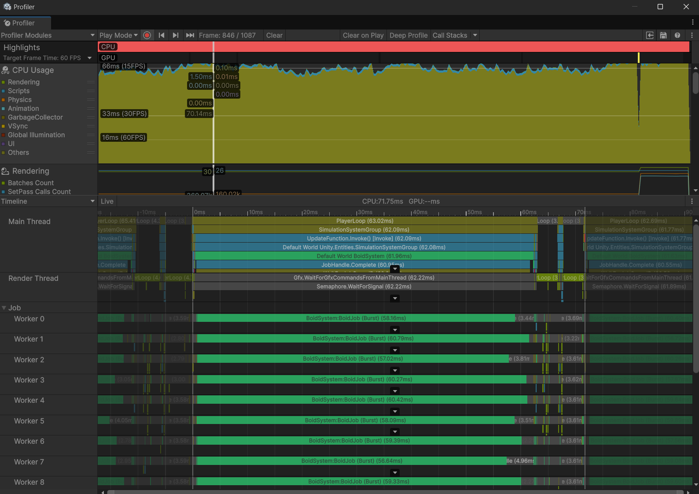

 
# Boids Simulation - Unity- DOTS, ECS

A Unity DOTS (Data-Oriented Technology Stack) implementation of the classic boids flocking algorithm, optimized for simulating large numbers of autonomous agents.

  

## Overview

This project demonstrates an efficient implementation of Craig Reynolds' Boids algorithm using Unity's Entity Component System (ECS) and the Burst compiler. The simulation can handle tens of thousands of boids while maintaining interactive framerates.

## Features

- **Spatial Partitioning**: Optimized grid-based spatial hashing for efficient neighbor lookups
- **Burst Compilation**: All computation-heavy jobs are Burst-compiled for maximum performance
- **Job System Integration**: Parallel processing across multiple CPU cores
- **Persistent Memory Management**: Efficient memory usage with minimized allocations
- **Vectorized Math**: SIMD-friendly mathematical operations
- **Dynamic Resizing**: Automatic management of data structures as boid count changes
- **Configurable Parameters**: Easily adjust separation, alignment, cohesion, and other boid behaviors

## Implementation Details

The core simulation consists of three main stages executed as jobs:

1. **Spatial Partitioning**: Each boid is assigned to a cell in a 3D grid
2. **Neighbor Processing**: Efficiently build lookup tables for accessing neighbors
3. **Force Calculation**: Calculate and apply the three classic boid forces:
   - **Separation**: Steer to avoid crowding local flockmates
   - **Alignment**: Steer towards the average heading of local flockmates
   - **Cohesion**: Steer toward the average position of local flockmates

All jobs are efficiently scheduled with proper dependencies to maximize CPU utilization.

## Performance Optimizations

- Optimized cell-neighbor lookup using flattened 3D indexing
- Efficient force calculations with combined neighbor checks
- Mathematics optimizations using rsqrt() for faster normalization
- Persistent data structures to minimize garbage collection
- Optimal batch sizing for job scheduling
- Enhanced boundary force calculations

## Configuration Components

- **BoidAuthoring**: Configure individual boid behaviors and parameters
- **BoidBoundaryAuthoring**: Set up the simulation boundaries
- **BoidSpawnerAuthoring**: Create and initialize large numbers of boids

## Usage

1. Add BoidAuthoring to a prefab with a mesh renderer
2. Add BoidBoundaryAuthoring to an empty GameObject in your scene
3. Add BoidSpawnerAuthoring to another empty GameObject and set your boid prefab
4. Adjust parameters as needed and press play

## Requirements

- Unity 2022.3 or newer
- Entities package
- Burst package
- Mathematics package